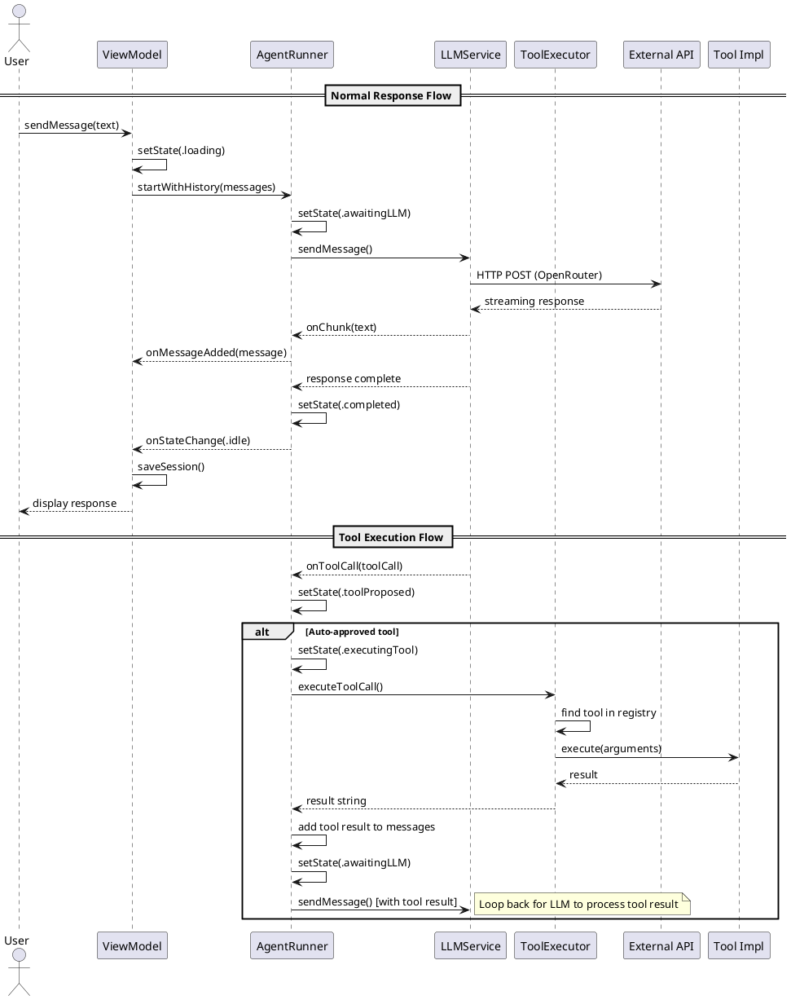
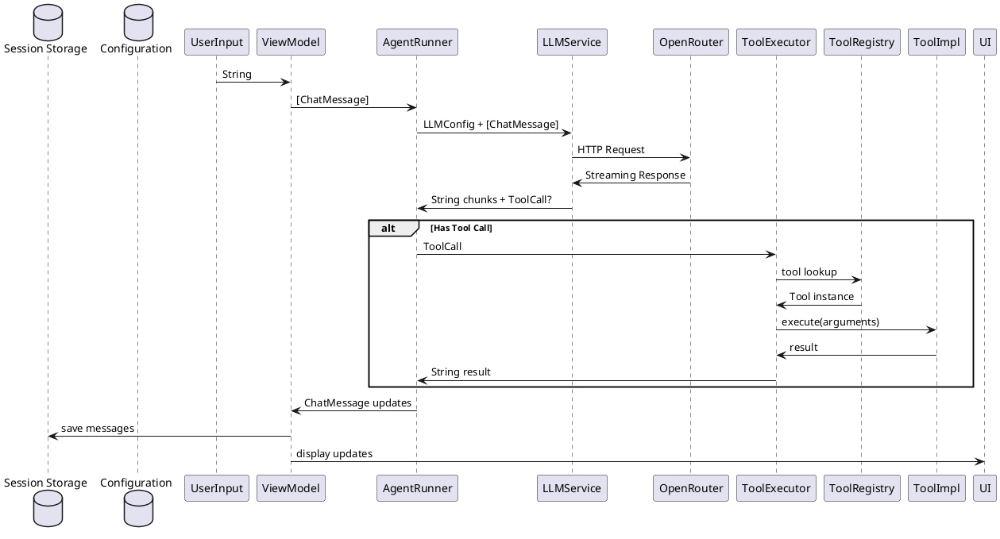

# ユーザー入力から出力までの完全な動作フロー可視化ドキュメント実装計画

## 目的と範囲
ユーザーの入力からシステム(kuroko)の処理を経て出力に至るまでの完全な動作フローを可視化し、どのような処理が行われ、どのような決定が行われるかを明確にする。

### 対象範囲
- **ユーザー入力受付から最終出力まで**: エンドツーエンドの処理フロー
- **すべての主要コンポーネント**: UIレイヤー、ビジネスロジック、外部API通信
- **状態遷移と条件分岐**: 正常フロー、ツール実行フロー、エラーハンドリング
- **データフロー**: 各コンポーネント間でのデータ受け渡し

### 除外範囲
- テストコードの実行フロー
- 内部実装の詳細（アルゴリズムレベル）
- 外部ライブラリの動作（SwiftUI, Foundationなど）

## 変更予定のファイルパスと具体的な変更内容

### 新規作成ファイル
- `/.docs/user-input-to-output-flow.md`: ユーザー入力から出力までの完全な動作フロー説明ドキュメント
- `/.docs/processing-sequence-diagram.puml`: PlantUML形式のシーケンス図
- `/.docs/data-flow-diagram.puml`: データフロー図
- `/.docs/component-interaction-flow.puml`: コンポーネント間相互作用図

### 既存ファイルの変更
- `/.docs/README.md`: 新しいフロー可視化ドキュメントの追加と説明

## 詳細な技術設計

### 1. 全体アーキテクチャのレイヤー構造
```
┌─────────────────┐
│   UI Layer      │  ← KurokoViewModel, Views
├─────────────────┤
│ Business Logic  │  ← AgentRunner, State Machine
├─────────────────┤
│   Service Layer │  ← LLMService, ToolExecutor, Config
├─────────────────┤
│  External APIs  │  ← OpenRouter API, Tool Implementations
└─────────────────┘
```

### 2. 処理シーケンスの詳細設計

#### 基本フロー（通常応答）
1. **ユーザー入力受付**: KurokoViewModel.sendMessage()
2. **UI状態更新**: loading状態に遷移
3. **AgentRunner初期化**: 初回のみ、設定とシステムプロンプトで初期化
4. **メッセージ履歴設定**: システムプロンプト + 会話履歴
5. **LLM問い合わせ**: awaitingLLM状態 → OpenRouter API呼び出し
6. **ストリーミング応答処理**: チャンク受信 → UI更新
7. **応答完了**: completed状態 → UI状態をidleに
8. **セッション保存**: 自動保存

#### ツール実行フロー
1. **LLM応答解析**: ツール呼び出し検出
2. **ツール提案**: toolProposed状態
3. **承認判定**: needsApproval()による自動/手動判定
4. **承認プロセス**: 自動承認 or ユーザー承認待ち
5. **ツール実行**: executingTool状態 → DefaultToolExecutor
6. **結果処理**: ツール結果を会話履歴に追加
7. **再LLM問い合わせ**: awaitingLLM状態に戻り、結果を考慮した応答生成

#### エラーハンドリングフロー
1. **APIエラー**: HTTPエラー → エラーメッセージ表示
2. **ツール実行エラー**: ToolError → エラー状態遷移
3. **タイムアウト**: キャンセル処理 → 中断メッセージ

### 3. 可視化図の設計

#### シーケンス図 (PlantUML)


#### データフロー図


### 4. ドキュメント構造設計

#### user-input-to-output-flow.md の構成
1. **概要**: 全体的な処理フローの概要
2. **主要コンポーネント**: 各レイヤーの役割説明
3. **処理シーケンス**: ステップバイステップの詳細フロー
4. **状態遷移**: AgentRunnerの状態遷移図
5. **データフロー**: 各コンポーネント間でのデータ受け渡し
6. **条件分岐**: ツール実行、承認プロセス、エラーハンドリング
7. **設定と設定**: 各種設定が処理に与える影響

#### README.md 更新内容
- 新しいドキュメントの追加案内
- 各図の簡単な説明と参照方法
- 開発者向け利用ガイド

## 想定されるリスクとエッジケース

### リスク
1. **複雑さの増大**: システムが複雑で完全な可視化が難しい
   - 対策: レイヤー分けと段階的な説明で整理

2. **正確性の欠如**: 実装変更時のドキュメント陳腐化
   - 対策: コードとドキュメントの対応関係を明確にし、更新時の指針を提供

3. **可読性の低下**: 詳細すぎる情報が理解を妨げる
   - 対策: 要約と詳細の分離、図表の効果的な活用

### エッジケース
- **ストリーミング中断**: ネットワーク切断時の処理
- **ツール実行失敗**: 各種エラーのハンドリング
- **承認プロセス**: ユーザー承認のタイムアウト
- **並列処理**: 複数のツール呼び出し
- **メモリ管理**: 大量メッセージ時の処理

## 実装手順

### Phase 1: ドキュメント構造作成
1. user-input-to-output-flow.md の基本構造作成
2. 各セクションのヘッダーと概要記述

### Phase 2: シーケンス図作成
1. PlantUMLファイルの作成
2. 基本フロー、ツール実行フロー、エラーフローの記述

### Phase 3: データフロー図作成
1. コンポーネント間データフローのマッピング
2. PlantUML形式での表現

### Phase 4: 詳細説明文書の作成
1. 各処理ステップの詳細説明
2. 条件分岐と状態遷移の説明
3. 設定パラメータの影響説明

### Phase 5: README更新と統合
1. 新しいドキュメントのREADMEへの追加
2. 相互参照の設定
3. 利用ガイドの作成

## 品質基準

### 完全性
- すべての主要処理パスをカバー
- エラーケースとエッジケースを含む
- 設定変更が処理に与える影響を説明

### 正確性
- 実際のコード実装と一致
- 状態遷移が正確に記述
- データフローが正しく表現

### 可読性
- 論理的な順序で説明
- 図表で複雑なフローを視覚化
- 用語の統一と定義

### 保守性
- ドキュメント間の整合性
- 更新時の変更点が明確
- バージョン管理との連携

## 完了条件チェックリスト

- [ ] ユーザー入力受付から出力までの全フローが記述されている
- [ ] 主要コンポーネントの役割が明確に説明されている
- [ ] 状態遷移と条件分岐が正確に表現されている
- [ ] データフローが視覚的に表現されている
- [ ] エラーハンドリングとエッジケースが考慮されている
- [ ] README.mdが適切に更新されている
- [ ] ドキュメント間の相互参照が設定されている
