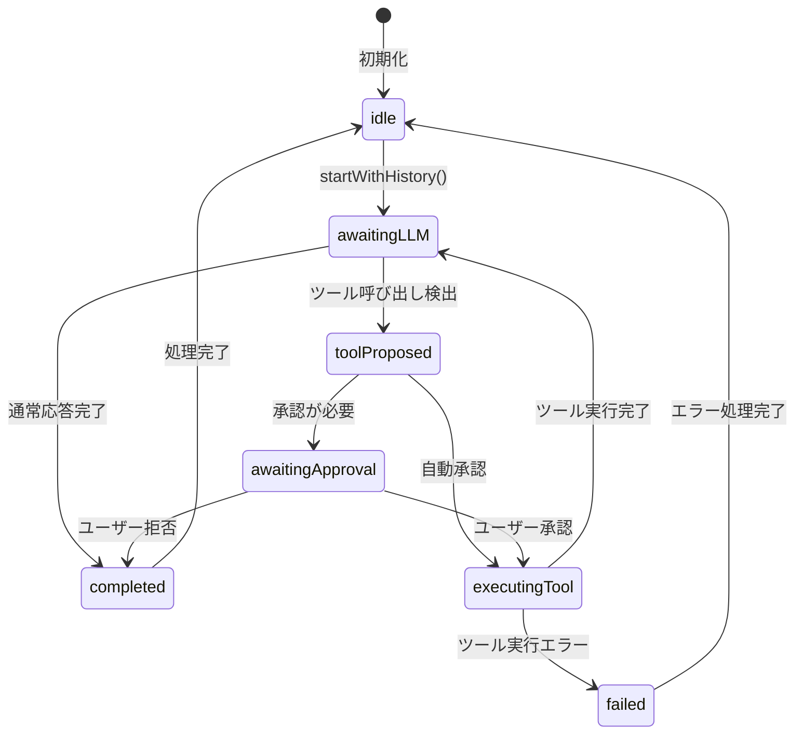

# ユーザー入力から出力までの完全な動作フロー

## 概要

このドキュメントでは、kurokoシステムにおいてユーザーの入力がどのように処理され、最終的な出力に至るまでの完全な動作フローについて説明します。

kurokoは、ユーザーの自然言語入力をLarge Language Model (LLM) に送信し、必要に応じてツールを実行しながら自律的にタスクを解決するAIエージェントシステムです。

## アーキテクチャ概要

```
┌─────────────────┐
│   UI Layer      │  ← ユーザーインターフェース、状態表示
├─────────────────┤
│ Business Logic  │  ← エージェント実行、状態遷移管理
├─────────────────┤
│   Service Layer │  ← LLM通信、ツール実行、設定管理
├─────────────────┤
│  External APIs  │  ← OpenRouter API、macOSフレームワーク
└─────────────────┘
```

## 主要コンポーネント

### UI Layer (プレゼンテーション層)
- **KurokoViewModel**: UI状態管理、ユーザー入力処理、ViewModel
- **ChatView**: チャットインターフェースの表示
- **MessageBubble**: 個別のメッセージ表示
- **ToolResultView**: ツール実行結果の表示

### Business Logic Layer (ビジネスロジック層)
- **AgentRunner**: エージェントの実行管理、状態遷移制御
- **SessionManager**: セッションの保存・復元管理

### Service Layer (サービス層)
- **OpenRouterLLMService**: OpenRouter APIとの通信
- **DefaultToolExecutor**: ツールの実行管理
- **ToolRegistry**: 利用可能なツールの登録管理
- **KurokoConfigurationService**: 設定の一元管理

### Tool Layer (ツール層)
- **FileSystemTools**: ファイル操作
- **AppleCalendarTool**: カレンダー操作
- **AppleRemindersTool**: リマインダー操作
- **GoogleSearchTool**: ウェブ検索

## 処理シーケンスの詳細

### Phase 1: 初期化フェーズ

アプリ起動時に以下の初期化が行われます：

1. **KurokoViewModelの初期化**
   - ConfigurationServiceから設定を取得
   - LLMServiceFactoryでLLMサービスを生成
   - SessionManagerで現在のセッションを復元

2. **AgentRunnerの準備**
   - 初回のメッセージ送信まで待機（lazy initialization）

### Phase 2: ユーザー入力処理フェーズ

ユーザーがメッセージを送信すると以下の処理が発生します：

```swift
// KurokoViewModel.sendMessage()
func sendMessage() {
    inputText = ""  // 入力欄クリア
    viewState = .loading  // UIをloading状態に
    messages.append(userMessage)  // 会話履歴に追加

    // AgentRunnerの初期化（初回のみ）
    if agentRunner == nil {
        agentRunner = AgentRunner(...)
    }

    // エージェント実行開始
    try await agentRunner?.startWithHistory(messages)
}
```

### Phase 3: AgentRunner実行フェーズ

AgentRunnerは以下の状態遷移で処理を進めます：

#### 3.1 初期状態設定
```swift
// AgentRunner.startWithHistory()
messages = [ChatMessage(role: .system, text: systemPrompt)] + conversationHistory
toolCallCount = 0
state = .awaitingLLM
runLoop()  // メイン処理ループ開始
```

#### 3.2 LLM問い合わせ状態（awaitingLLM）
```swift
// AgentRunner.callLLM()
let config = LLMConfig(model: selectedModel)
var assistantMessage = ChatMessage(role: .assistant, text: "", isStreaming: true)

// OpenRouterLLMService.sendMessage() を呼び出し
try await llmService.sendMessage(
    message: "",
    history: messages.dropLast(),  // 現在のassistantメッセージ以外
    config: config,
    onChunk: { chunk in
        // ストリーミングチャンク受信時の処理
        responseText += chunk
        let userFriendlyText = parseUserFriendlyResponse(from: responseText)
        assistantMessage.text = userFriendlyText
        onMessageAdded?(assistantMessage)  // UI更新
    },
    onToolCall: { toolCall in
        receivedToolCall = toolCall  // ツール呼び出し検出
    }
)
```

#### 3.3 ストリーミング応答処理

LLMからの応答はストリーミングで受信され、以下の処理が行われます：

1. **チャンク受信**: `onChunk`コールバックでテキスト断片を受信
2. **UI更新**: リアルタイムでメッセージを表示
3. **ツール呼び出し検出**: 応答に`tool_calls`が含まれている場合検出

#### 3.4 ツール呼び出し処理（toolProposed状態）

ツール呼び出しが検出された場合：

```swift
// ツール提案の作成
let proposal = ToolCallProposal(
    type: "tool_call",
    toolId: toolCall.function.name,
    input: parseFunctionArguments(toolCall.function.arguments),
    reason: "Tool execution requested by AI"
)

// 承認判定
if needsApproval(for: proposal) {
    state = .awaitingApproval(proposal)
    // ユーザー承認を待機
} else {
    state = .executingTool(proposal)
    // 自動実行へ
}
```

#### 3.5 ツール実行状態（executingTool）

```swift
// DefaultToolExecutor.executeToolCall()
let tool = toolRegistry.tool(forName: functionName)
let argsDict = parseArguments(toolCall.function.arguments)
let result = try await tool.execute(arguments: argsDict)

// 結果を会話履歴に追加
messages.append(ChatMessage(role: .tool, text: result, toolCallId: toolCall.id))

// LLM再問い合わせのために状態を戻す
state = .awaitingLLM
```

#### 3.6 完了状態（completed）

通常応答の場合は以下の処理：

```swift
let userFriendlyText = parseUserFriendlyResponse(from: responseText)
assistantMessage.text = userFriendlyText
assistantMessage.isStreaming = false
onMessageAdded?(assistantMessage)

state = .completed
// ViewModelに完了を通知
onStateChange?(.completed)
```

### Phase 4: UI更新と永続化フェーズ

```swift
// KurokoViewModel.handleAgentStateChange()
func handleAgentStateChange(_ state: AgentState) {
    switch state {
    case .awaitingApproval:
        viewState = .awaitingApproval
    case .completed:
        viewState = .idle
        saveCurrentSession()  // セッション保存
    case .failed(let error):
        viewState = .error(error)
    default:
        break
    }
}
```

## 状態遷移図



## データフロー

### 入力データフロー
```
ユーザー入力 (String)
    ↓
KurokoViewModel.inputText
    ↓
ChatMessage (role: .user)
    ↓
AgentRunner.messages (会話履歴)
    ↓
OpenRouter API (HTTP Request)
```

### 出力データフロー
```
OpenRouter API Response (JSON)
    ↓
ストリーミングチャンク (String)
    ↓
ChatMessage (role: .assistant, isStreaming: true)
    ↓
UI更新 (リアルタイム表示)
    ↓
ChatMessage (role: .assistant, isStreaming: false)
    ↓
SessionManager (永続化)
```

### ツール実行データフロー
```
ToolCall (JSON)
    ↓
ToolCallProposal
    ↓
DefaultToolExecutor
    ↓
ToolRegistry.tool()
    ↓
Tool.execute(arguments)
    ↓
String result
    ↓
ChatMessage (role: .tool)
    ↓
AgentRunner.messages
```

## 条件分岐と分岐処理

### 1. 承認モードによる分岐

```swift
func needsApproval(for proposal: ToolCallProposal) -> Bool {
    // ツールのautoApproval設定チェック
    if let tool = ToolRegistry.shared.tool(forName: proposal.toolId), tool.autoApproval {
        return false
    }

    // ツール呼び出し回数上限チェック
    if toolCallCount >= config.maxToolCallsPerRun {
        return true
    }

    // 承認モードによる判定
    switch config.approvalMode {
    case .alwaysAsk: return true
    case .perThread: return !threadGrant
    case .autoApprove: return false
    }
}
```

### 2. LLM応答内容による分岐

- **通常応答**: `<response>`タグの内容 or JSONのresponseフィールド
- **ツール呼び出し**: OpenAI形式 or JSON形式のtool_call
- **思考プロセス**: `<thinking>`, `<observation>`, `<reflection>`タグの内容

### 3. エラー処理の分岐

- **APIエラー**: HTTPステータスエラー → エラーメッセージ表示
- **ツール実行エラー**: ToolError → エラー状態遷移
- **ネットワークエラー**: タイムアウト → リトライ or エラー表示

## 設定とその影響

### 1. LLMモデル設定
```swift
// KurokoConfigurationService.selectedModel
// 影響: 異なるモデルで異なる応答品質・速度・コスト
```

### 2. 承認モード設定
```swift
enum ApprovalMode {
    case alwaysAsk      // すべてのツール実行で承認を求める
    case perThread      // スレッド内で一度承認したら自動
    case autoApprove    // すべてのツールを自動実行
}
```

### 3. システムプロンプト
```swift
// Resources/SystemPrompt.md
// 影響: LLMの動作パターン、ツール使用戦略、応答フォーマット
```

## エラーハンドリング

### 1. API通信エラー
- **タイムアウト**: 自動リトライ（3回まで）
- **認証エラー**: APIキー設定確認メッセージ
- **レートリミット**: 待機後にリトライ

### 2. ツール実行エラー
- **権限エラー**: macOS権限設定確認メッセージ
- **パラメータエラー**: 引数形式の検証エラー
- **実行時エラー**: ツール固有のエラーハンドリング

### 3. UI状態管理エラー
- **ストリーミング中断**: メッセージ状態の適切なクリーンアップ
- **状態不整合**: 状態遷移の原子性確保

## パフォーマンス考慮点

### 1. メモリ管理
- **会話履歴**: 長時間セッションでのメモリ使用量
- **ストリーミング**: リアルタイムUI更新の効率性

### 2. ネットワーク効率
- **ストリーミング**: チャンクサイズの最適化
- **キャッシュ**: 設定・セッションデータの効率的保存

### 3. UIレスポンシブネス
- **メインスレッド**: 非同期処理によるUIブロック回避
- **状態更新**: 効率的なUI更新メカニズム

## セキュリティ考慮点

### 1. データ保護
- **APIキー**: 安全なストレージ（Keychain）
- **ユーザー入力**: 適切なサニタイズ

### 2. 権限管理
- **ファイルアクセス**: macOSセキュリティフレームワーク
- **システムリソース**: カレンダー・リマインダーアクセス権限

### 3. 実行制御
- **ツール実行**: 承認プロセスによる安全確保
- **外部API**: 信頼できるプロバイダーの使用

## 拡張性と保守性

### 1. コンポーネントの分離
- **プロトコルベース**: LLMService, ToolExecutorなどの抽象化
- **依存性注入**: テスト容易性と設定柔軟性

### 2. 設定管理
- **集中管理**: KurokoConfigurationService
- **動的変更**: 実行時の設定更新対応

### 3. エラートラッキング
- **構造化エラー**: ToolError, AgentErrorなどの型付け
- **ログ出力**: デバッグ情報の適切な記録

## 関連ドキュメント

- [processing-sequence-diagram.puml](./processing-sequence-diagram.puml) - シーケンス図
- [data-flow-diagram.puml](./data-flow-diagram.puml) - データフロー図
- [component-interaction-flow.puml](./component-interaction-flow.puml) - コンポーネント相互作用図
- [architecture-overview.md](./architecture-overview.md) - アーキテクチャ概要

---

*このドキュメントはシステムの実装に基づいて記述されています。コード変更時には適宜更新してください。*
