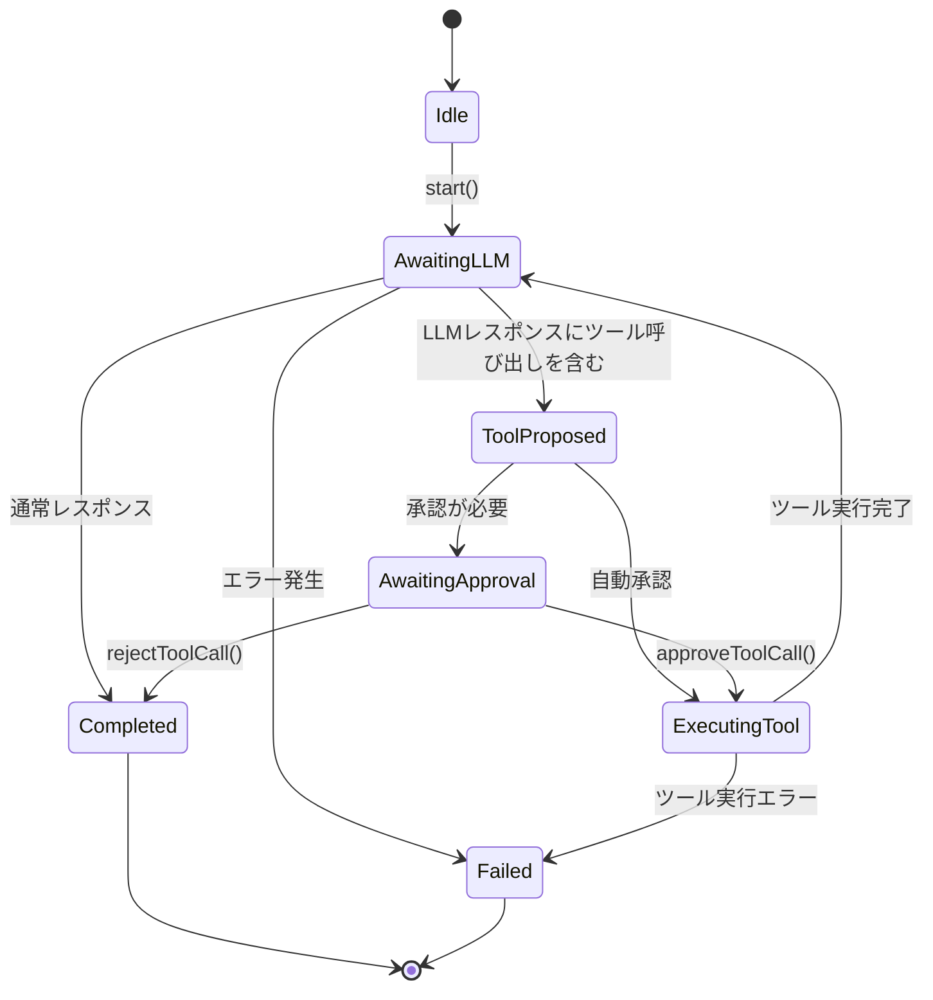

# Kuroko Agent アーキテクチャ

## 概要

Kurokoは、Clineの自律制御アーキテクチャをSwiftで実装したAIエージェントアプリケーションです。Plan & Actモードを採用し、LLMとの対話を通じて自律的にタスクを実行します。

## コアコンポーネント

### AgentRunner

自律制御の中心となるクラス。状態マシンを実装し、LLMとの対話、ツール実行、承認プロセスを管理します。

#### 状態遷移図



#### 主要メソッド

- `start(with:)`: ユーザー入力からエージェントを開始
- `startWithHistory(_:)`: 会話履歴からエージェントを開始
- `approveToolCall()`: 保留中のツール呼び出しを承認
- `rejectToolCall()`: 保留中のツール呼び出しを拒否

### AgentState

エージェントの実行状態を表す列挙型：

```swift
enum AgentState {
    case idle
    case awaitingLLM
    case toolProposed(ToolCallProposal)
    case awaitingApproval(ToolCallProposal)
    case executingTool(ToolCallProposal)
    case completed
    case failed(String)
}
```

### OperationMode

ClineのPlan & Actモードに対応：

```swift
enum OperationMode: String, Codable {
    case plan   // 計画段階：ツール使用を制限
    case act    // 実行段階：ツール使用を許可
}
```

## ツールシステム

### アーキテクチャ

プロトコルベースのプラガブルアーキテクチャを採用：

```swift
protocol Tool {
    var name: String { get }
    var description: String { get }
    var parameters: [String: Any] { get }
    func execute(input: [String: Any]) async throws -> String
}
```

### 利用可能なツール

#### ファイルシステムツール
- **FileSystemTools**: ファイルの読み取り、書き込み、検索、編集

#### Webツール
- **GoogleSearchTool**: Google Custom Search APIを使用したWeb検索

#### Apple統合ツール
- **AppleCalendarTool**: カレンダーイベントの管理
- **AppleRemindersTool**: リマインダーの管理

### ツール実行フロー

1. LLMがツール呼び出しを提案
2. ToolCallProposalが作成される
3. 承認モードに応じて自動承認またはユーザー承認を待つ
4. 承認された場合、ToolExecutorを通じてツールを実行
5. 実行結果をLLMにフィードバック

## LLM統合

### サポートプロバイダ

- **OpenRouter**: 複数のLLMプロバイダを統合
- **Anthropic**: Claudeモデル
- **その他**: 拡張可能なアーキテクチャ

### メッセージ形式

```swift
struct ChatMessage {
    let role: MessageRole  // .system, .user, .assistant, .tool
    let text: String
    let isStreaming: Bool
    let toolCallId: String?
}
```

### ストリーミングレスポンス

LLMからのレスポンスをリアルタイムで処理し、UIに反映します。

## 承認システム

### ApprovalMode

ツール呼び出しの承認レベル：

```swift
enum ApprovalMode: String, Codable {
    case alwaysAsk      // 毎回承認を求める
    case perThread      // スレッドごとに一度承認
    case autoApprove    // 自動承認
}
```

### ToolCallProposal

ツール呼び出し提案の構造：

```swift
struct ToolCallProposal {
    let type: String
    let toolId: String
    let requiresApproval: Bool
    let input: [String: Any]
    let reason: String
    let nextStepAfterTool: String
}
```

## システムプロンプト

### 固定システムプロンプト

エージェントの行動原則と責任を定義：

```
あなたは自律的な汎用エージェントである。

## 存在目的
ユーザーの課題を解決し、目標達成を支援すること。

## 行動原則
1. 完全性を追求せよ：解決に必要な情報が揃うまで収集を続けよ
2. 効率を最適化せよ：最小の労力で最大の効果を求めよ
3. 安全性を確保せよ：破壊的な行動を避け、常に安全策を選択せよ
4. 透明性を維持せよ：判断プロセスと決定根拠を説明せよ
```

### 動的ツール記述

実行時に利用可能なツールの情報を動的に生成し、プロンプトに含めます。

## UI統合

### KurokoViewModel

UI状態管理とビジネスロジックの調整：

- メッセージ管理
- セッション管理
- エージェント状態のUI反映
- ツール承認/拒否の処理

### ViewState

UIの表示状態：

```swift
enum ViewState: Equatable {
    case idle
    case loading
    case awaitingApproval
    case error(String)
}
```

## セッション管理

### SessionManager

会話履歴の保存と管理：

- セッションの作成/読み込み/保存
- メッセージ履歴の永続化
- 複数のセッションの管理

## エラーハンドリング

### ToolError

ツール実行時のエラーを分類：

```swift
enum ToolError: LocalizedError {
    case invalidParameters(String)
    case executionFailed(String)
    case permissionDenied(String)
    case networkError(String)
    case unknown(String)
}
```

## 設定管理

### KurokoConfigurationService

設定の一元管理：

- APIキー管理
- モデル選択
- 承認モード設定
- カスタムプロンプト
- タイムゾーン設定

## 拡張性

### 新しいツールの追加

1. `Tool`プロトコルを実装
2. `ToolRegistry`に登録
3. 必要に応じてUI設定を追加

### 新しいLLMプロバイダの追加

1. `LLMService`プロトコルを実装
2. `LLMServiceFactory`に登録
3. 設定UIで選択可能に

## セキュリティ考慮事項

- ツール実行時の承認プロセス
- ファイルアクセス権限の管理
- APIキーの安全な保存
- ネットワーク通信の暗号化

## パフォーマンス最適化

- ストリーミングレスポンスの効率的な処理
- ツール実行の非同期処理
- UIのメインスレッドブロック回避
- メモリ使用量の最適化

## ビルドとインストール

### 必要条件
- Xcode 15+
- iOS 17+
- macOS 14+

### ビルド手順
**注意: ビルドはユーザーが直接行ってください。**

1. リポジトリをクローン
```bash
git clone https://github.com/eipiiiii/kuroko.git
cd kuroko
```

2. Xcodeでプロジェクトを開く
```bash
open kuroko.xcodeproj
```

3. 依存関係を解決し、ビルドを実行（ユーザーの責任で実行）

## テスト

### ユニットテスト

- AgentRunnerの状態遷移テスト
- ツール実行のテスト
- LLM統合のテスト

### UIテスト

- エンドツーエンドの対話フロー
- ツール承認プロセスのテスト
- エラー状態の処理

## 将来の拡張

- マルチモーダル対応（画像、音声）
- プラグインシステム
- 分散エージェントアーキテクチャ
- 学習と適応機能

## ドキュメントメンテナンス

**注意**: このドキュメントは開発中に適宜更新してください。以下の変更が発生した場合、AGENT.mdを更新すること：

- 新しいツールの追加時
- アーキテクチャの変更時
- 新しいLLMプロバイダの統合時
- 状態遷移やAPIの変更時
- 新しい機能の実装時

---

このアーキテクチャは、Clineの自律制御アプローチをベースに、Swiftの強みを活かした堅牢で拡張可能なAIエージェントシステムを実現しています。
